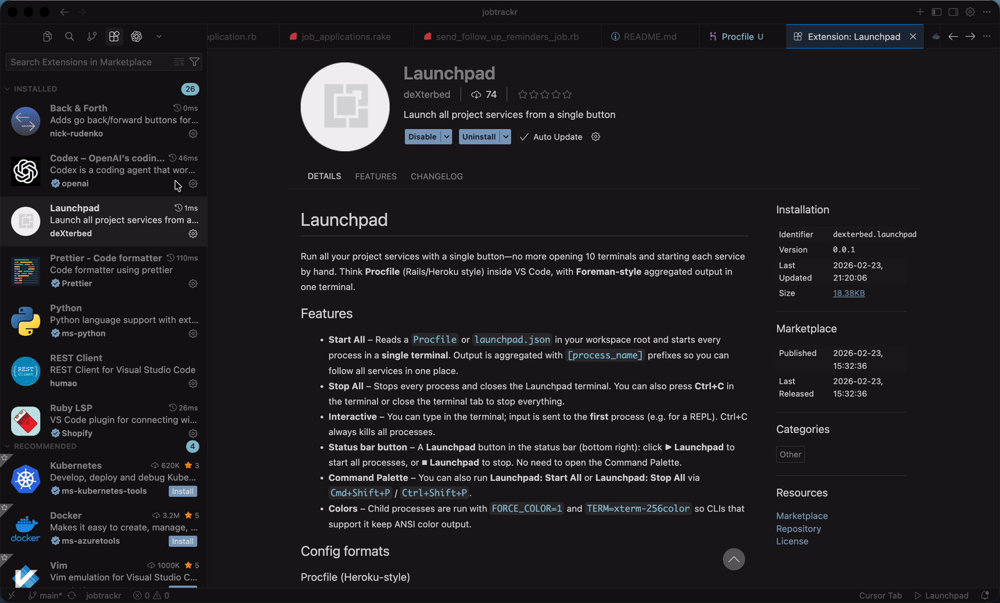

# Launchpad

Run all your project services with a single button—no more opening 10 terminals and starting each service by hand. Think **Procfile** (Rails/Heroku style) inside VS Code, with **Foreman-style** aggregated output in one terminal.

**One terminal. One Ctrl+C. No tab hunting.**



## Quick Start (30 seconds)

1. In your project root, create a `Procfile`:
   ```
   web: npm run dev
   api: npm run start
   ```
2. Click **▶ Launchpad** in the status bar (bottom right).  
   Done.

## Why not docker-compose?

- No containers
- Uses your local dev env
- Runs inside VS Code
- Zero setup

## Features

- **Start All** – Reads a `Procfile` or `launchpad.json` in your workspace root and starts every process in a **single terminal** (most tools spawn many; Launchpad aggregates). Output is prefixed with `[process_name]` so you can follow all services in one place.
- **Stop All** – Stops every process and closes the Launchpad terminal. You can also press **Ctrl+C** in the terminal or close the terminal tab to stop everything.
- **Interactive** – You can type in the terminal; input is sent to the **first** process (e.g. for a REPL). Ctrl+C always kills all processes.
- **Status bar button** – A **Launchpad** button in the status bar (bottom right): click **▶ Launchpad** to start all processes, or **⏹ Launchpad** to stop. No need to open the Command Palette.
- **Command Palette** – You can also run **Launchpad: Start All** or **Launchpad: Stop All** via `Cmd+Shift+P` / `Ctrl+Shift+P`.
- **Colors** – Child processes are run with `FORCE_COLOR=1` and `TERM=xterm-256color` so CLIs that support it keep ANSI color output.

## Config formats

### Procfile (Heroku-style)

In the root of your workspace, create a `Procfile`:

```
web: npm run dev
api: npm run start:api
worker: bundle exec sidekiq
redis: redis-server
```

Each line is `name: command`. Comments start with `#`.

### launchpad.json (for monorepos)

For per-process working directories or env vars, use `launchpad.json`:

```json
{
  "processes": [
    { "name": "web", "command": "npm run dev" },
    { "name": "api", "command": "npm run start:api", "cwd": "./apps/api" },
    { "name": "worker", "command": "bundle exec sidekiq", "env": { "RAILS_ENV": "development" } }
  ]
}
```

- **name** – Label shown in the aggregated output (e.g. `[web]`, `[api]`).
- **command** – Command to run (e.g. `npm run dev`).
- **cwd** – Optional working directory (relative to workspace root).
- **env** – Optional env vars for that process.

If both `Procfile` and `launchpad.json` exist, `launchpad.json` is used.

## Usage

1. Open your project folder in VS Code.
2. Add a `Procfile` or `launchpad.json` in the workspace root (or run **Start All** and choose “Create Procfile” / “Create launchpad.json” when prompted).
3. Click **▶ Launchpad** in the status bar (bottom right), or run **Launchpad: Start All** from the Command Palette (`Cmd+Shift+P` → type “Launchpad” or “Start All”).
4. All output appears in one **Launchpad** terminal with prefixed lines (e.g. `[web]`, `[api]`), e.g.:
   ```
   [web] starting: npm run dev
   [web] Server listening on 3000
   [api] starting: npm run start:api
   [api] API ready
   ```
5. To stop everything: click **⏹ Launchpad** in the status bar, run **Launchpad: Stop All** from the Command Palette, press **Ctrl+C** in the terminal, or close the Launchpad terminal tab.

## Requirements

- VS Code or Cursor `^1.105.0`
- A workspace folder open (single or multi-root; in multi-root, the first folder or one that contains a config is used).

## Contributing / Development

1. **Build and run**
   - Open the Launchpad repo in VS Code.
   - Run `npm run compile` (or rely on the pre-launch task).
   - Press **F5** or choose **Run > Start Debugging** to open an **Extension Development Host** window with the extension loaded.

2. **Confirm the extension is loaded (in the new window)**
   - In the **Extension Development Host** window (the one that opened when you pressed F5), make sure you’re not still in the original editor window.
   - Open **Extensions** (`Cmd+Shift+X`). In the search box, type **Launchpad**. You should see **Launchpad** with a **Development** badge (it’s loaded from your repo).
   - If you don’t see it: in the window where you pressed F5, the **root folder** must be the Launchpad repo (File → Open Folder → select the `launchpad` folder), then press F5 again.
   - To check for load errors: in the Extension Development Host window, **Help → Toggle Developer Tools → Console**. Look for red errors when the window loads; any error there can prevent the extension from activating.

3. **Try it in the new window**
   - In the Extension Development Host window, open a folder (e.g. any project, or the Launchpad repo itself).
   - Add a `Procfile` in that folder’s root, for example:
     ```
     web: echo "web started" && sleep 60
     api: echo "api started" && sleep 60
     ```
   - Run **Launchpad: Start All** via the Command Palette (`Cmd+Shift+P` → type “Launchpad” or “Start All”).
   - You should see one **Launchpad** terminal with prefixed lines from both processes.
   - Run **Launchpad: Stop All** or press **Ctrl+C** in that terminal to stop everything.

4. **Automated tests** (optional)
   - From the repo root: `npm test` (runs the extension test suite, if configured).

## Release Notes

### 0.0.1

- Procfile and launchpad.json support; Foreman-style aggregated output in one terminal.
- Status bar button (**▶** / **⏹ Launchpad**) and Command Palette commands; Ctrl+C or closing the terminal stops all processes.
- Line-buffered output so logs don’t break mid-line; `[name]` tags with no extra padding.
- Color output enabled via `FORCE_COLOR=1` and `TERM=xterm-256color` for child processes.
